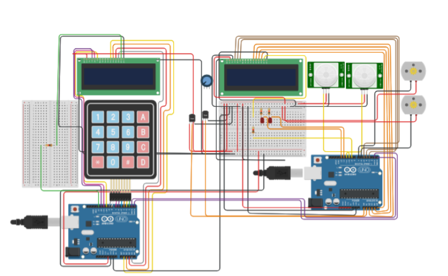

# Arduino Smart Home project
This is an embedded software project builded in Arduino UNO development board.

The project implements some electronic components like DC motors, LCD modules, PIR sensors and others to read somo enviroment data and display that data in LCD simulating a smart home.

## Development tools
* [C / C++ programming language](https://learn.microsoft.com/en-us/cpp/c-language/?view=msvc-170)
* [Arduino IDE](https://www.arduino.cc/en/software)

## Hardware
* [Arduino UNO](https://arduino.cl/arduino-uno/)
* [Arduino Kit](https://store.arduino.cc/products/arduino-starter-kit-multi-language)

